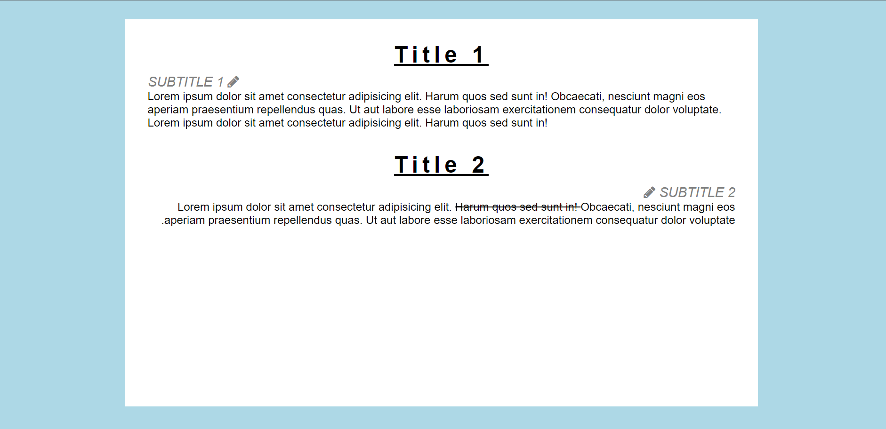

# Font Exercise

### Instructions:

Style the page as in the picture below. You find the picture also in the img-folder. In the main.html you will find the basic skeleton of the webpage. 
 
Start by using the picture as reference and if you need further guidance use the written instructions below.

1. Link the stylesheet to your html page

2. The background of the page is `lightblue`. 

3. The `wrapper` should be located in the middle of the page. It has a width of 70% and a height of 90% of the visible window. Furthermore there is some space between the `wrapper` and the text in the `content-box`.

4. The `Title` should be centered in its parent box. It should be 2x bigger than the base font-size and is underlined. The spacing between each letter is wider than usual. 

5. The `Subtitle` should be uppercase, gray and cursive (italic). It's font weight is slightly lighter than usual and it should be 1.2x of its usual size. 

6. There is a little icon from fontawesome `fa-pencil`next to the subtitle. Paste this line: `<link href="http://cdnjs.cloudflare.com/ajax/libs/font-awesome/4.3.0/css/font-awesome.css" rel="stylesheet"  type='text/css'>` into the `<head>` of your html page. 

7. The text in the second box goes from right to left. 

8. Don't forget to cross out the words in the 2nd paragraph.

9. Try to increase the spaces where it seems necessary. 

 
**Bonus:**

Increase the space between the letters of the `<h1>` 
Add more space between the lines of the blockquote element.

Use google and documentation to solve this bonus task. 

